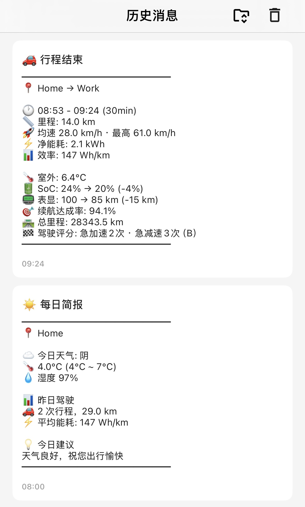

<h1 align="center">Tesla Notifier</h1>
<p align="center">简体中文 ｜ <a href="README_EN.md">English</a></p>

<p align="center">
  <a href="https://github.com/MokoYee/tesla-notifier/releases"></a>
  <a href="https://github.com/MokoYee/tesla-notifier/stargazers"></a>
  <a href="https://github.com/MokoYee/tesla-notifier/blob/main/LICENSE"></a>
  <a href="https://github.com/MokoYee/tesla-notifier/actions/workflows/build.yml"></a>
</p>

TeslaMate 车辆状态推送插件，聚焦通知而不是重后台: 行程结束、充电完成、哨兵事件和安全提醒实时推送到 iPhone，让你随时掌握爱车动态。

## 📸 推送示例


## 功能

### 实时推送（MQTT 驱动）

- **行程结束推送** - 行程结束后自动推送详情（起终点、里程、能耗、100 分制驾驶评分、路况分析）
- **充电完成推送** - 充电完成后推送充电详情（充入电量、峰值功率、费用）
- **哨兵模式推送** - 哨兵模式激活/关闭状态推送，支持实时录制事件提醒
- **离车安全提醒** - 离车后检测未锁车、门窗未关、前后备箱未关、充电口未关
- **胎压异常提醒** - 基于 TeslaMate `tpms_soft_warning_*` 实时推送异常轮位和胎压
- **充电异常提醒** - 检测 `NoPower` 或充电提前停止且未达到目标电量的情况
- **行程路况分析** - 可选接入高德交通态势，低频采样后并入行程评分与分析文案
- **通知可信度元数据** - 系统通知和日志会记录事件 ID、事件类型、优先级和触发依据，便于回溯与排障

### 定时报告（Cron 驱动）

- **每日简报** - 每天早上推送天气预报 + 昨日驾驶汇总
- **周报** - 每周一推送本周驾驶统计
- **月报** - 每月1日推送上月驾驶统计


## 快速开始

推荐把 `tesla-notifier` 作为一个独立容器部署在 TeslaMate 所在的 Docker 网络中。默认情况下，你通常只需要修改 `.env`，不需要改 `docker-compose.yml`。

### 1. 下载模板文件

```bash
curl -O https://raw.githubusercontent.com/MokoYee/tesla-notifier/main/docker-compose.yml
curl -o .env https://raw.githubusercontent.com/MokoYee/tesla-notifier/main/.env.example
```

### 2. 编辑 `.env`

至少修改：

- `BARK_KEY`
- `DB_PASSWORD`（如果你的 TeslaMate 数据库不是默认密码）

默认模板已经适配 TeslaMate 标准服务名：

- `DB_HOST=database`
- `MQTT_URL=mqtt://mosquitto:1883`

如果你的 TeslaMate 服务名或端口不同，再按实际环境修改。

### 3. 如有需要，调整 Docker 网络名

仓库里的 `docker-compose.yml` 默认使用外部网络 `teslamate_default`。  
如果你的 TeslaMate 实际网络名不是这个，只需要改这一处：

```yaml
networks:
  teslamate_default:
    external: true
```

### 4. 启动服务

```bash
docker compose up -d
```

### 5. 更新镜像

```bash
docker compose pull && docker compose up -d
```

## 快速配置示例

下面是一份最常见、最容易直接用的 `.env` 示例：

```bash
BARK_KEY=your_bark_key

DB_HOST=database
DB_PORT=5432
DB_NAME=teslamate
DB_USER=teslamate
DB_PASSWORD=teslamate

ENABLE_MQTT=true
MQTT_URL=mqtt://mosquitto:1883

ENABLE_CRON=true
DAILY_CRON=0 8 * * *
WEEKLY_CRON=0 9 * * mon
MONTHLY_CRON=0 9 1 * *

CAR_ID=1
TZ=Asia/Shanghai
```

## 配置说明

完整环境变量说明请参考 [docs/environment.md](docs/environment.md)。

常用配置：

- `BARK_KEY`：必填，Bark 推送密钥
- `CAIYUN_TOKEN`：可选，补充更详细的天气信息
- `AMAP_KEY`：可选，补充更准确的中文地址
- `SENTRY_NOTIFY_ENABLED`：可选，开启哨兵事件提醒
- `DEPARTURE_SAFETY_NOTIFY_ENABLED`：可选，开启离车安全提醒
- `TPMS_NOTIFY_ENABLED`：可选，开启胎压异常提醒
- `CHARGING_ISSUE_NOTIFY_ENABLED`：可选，开启充电异常提醒
- `TRAFFIC_ANALYSIS_ENABLED`：可选，开启行程路况增强分析

默认已启用但通常无需显式配置：

- 弱网行程补偿
- 系统健康通知
- `./data` 下的推送状态持久化

## 天气服务

- **彩云天气**（推荐）- 配置 `CAIYUN_TOKEN` 后使用，支持空气质量、紫外线等数据
  - [申请 Token](https://platform.caiyunapp.com/)
  - [API 文档](https://docs.caiyunapp.com/weather-api/v2/v2.6/1-realtime.html)
- **Open-Meteo**（备用）- 免费，无需配置，彩云失败时自动回退

## 高德地图服务

配置 `AMAP_KEY` 后可启用两类能力：

- 逆地理编码: 将 GPS 坐标转换为更精确的中文地址
- 行程路况分析: 在行程中低频调用高德交通态势接口，汇总后并入行程评分与分析文案

**申请步骤：**

1. 注册 [高德开放平台](https://lbs.amap.com/) 账号
2. 进入控制台 → 应用管理 → 创建新应用
3. 添加 Key，服务平台选择「Web服务」
4. 将获取的 Key 配置到 `AMAP_KEY` 环境变量

**参考文档：**
- [逆地理编码 API](https://lbs.amap.com/api/webservice/guide/api/georegeo)
- [交通态势查询 API](https://lbs.amap.com/api/webservice/guide/api-advanced/traffic-situation-inquiry)

> 说明：逆地理编码通常是标准 Web 服务能力；交通态势查询在高德官方文档中标注为高级服务接口。若你的 key 无权限，本项目会自动降级为“无路况增强”，不会影响主通知。

## 架构

```
Tesla API → TeslaMate → PostgreSQL
                ↓
            MQTT Broker
                ↓
          Tesla Notifier → Bark → iPhone
```

## 免责声明与第三方声明

- 本项目是非官方社区工具，与 TeslaMate 官方项目不存在隶属、授权、赞助或背书关系。
- `TeslaMate` 是其原项目及相关权利人的名称/标识。本项目仅用于兼容说明，不主张相关商标权。
- 本项目默认通过 TeslaMate 已公开的 MQTT / PostgreSQL 数据进行读取与通知，不包含 TeslaMate 官方源码分发。
- 如果你自行修改、分发或通过网络提供修改后的 TeslaMate 实例，请自行遵守 TeslaMate 上游项目的 `AGPL-3.0` 许可证及其商标政策。
- 本项目当前保留 `GPL-3.0`，不建议在未完成版权归属梳理前直接改成 `MIT`；若未来直接引入或修改 TeslaMate 上游源码，再单独评估是否需要切换到 `AGPL-3.0` 兼容策略。
- 因上游协议、商标使用、部署方式或合规要求带来的风险，需要由实际部署者自行评估并承担。

## 许可证

GPL-3.0
