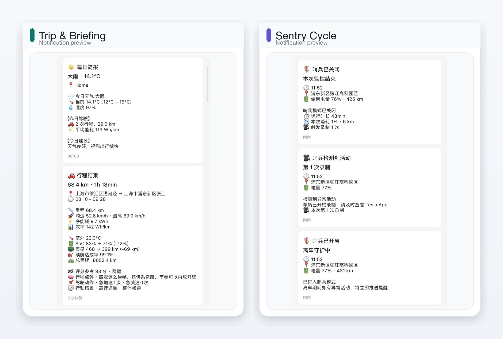
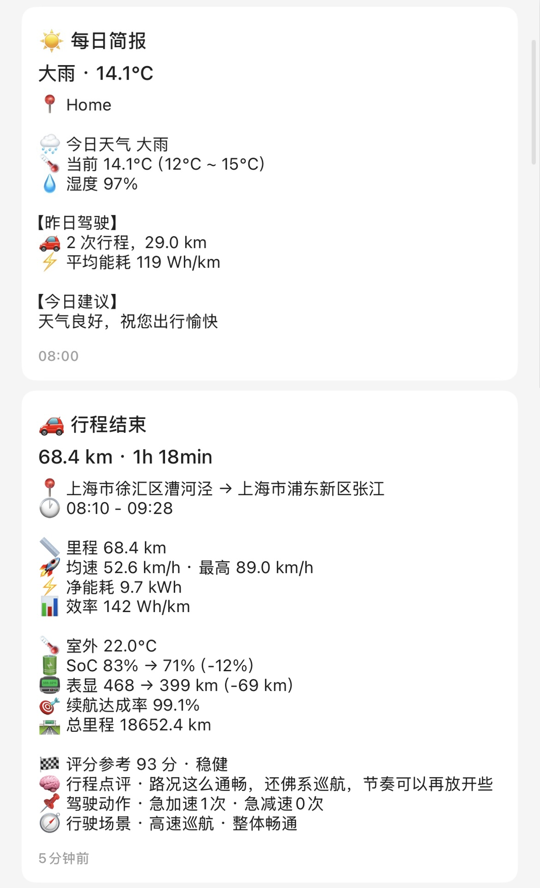
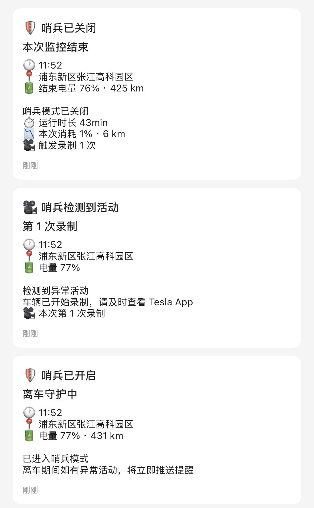
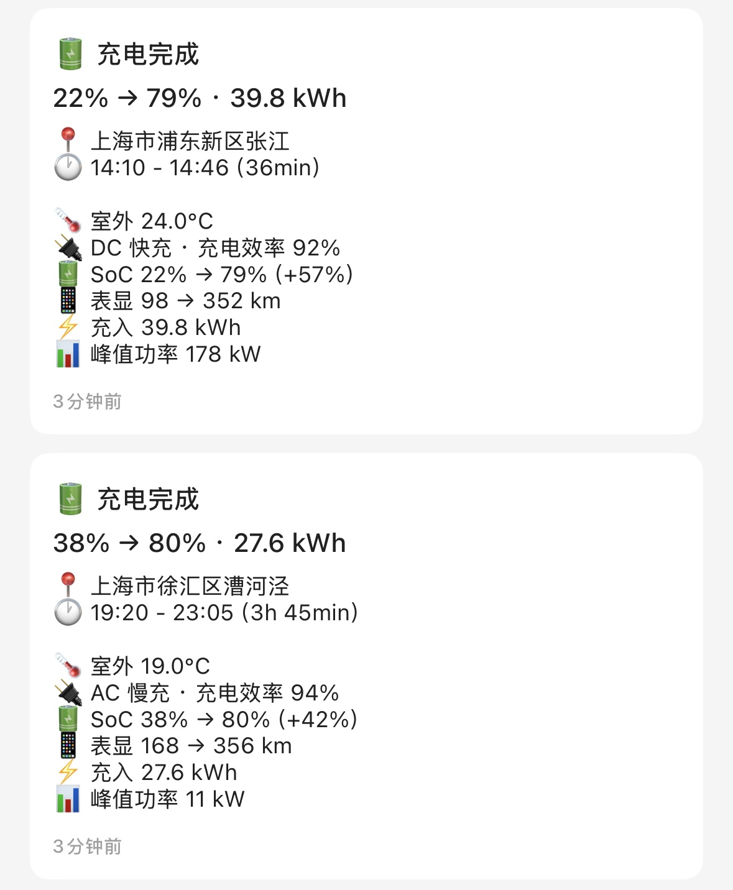
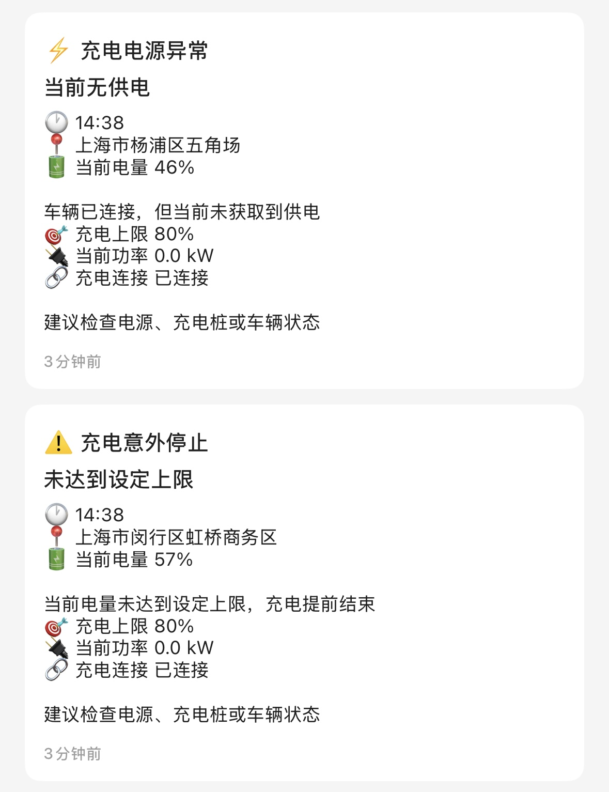

<h1 align="center">Tesla Notifier</h1>
<p align="center">简体中文 ｜ <a href="README_EN.md">English</a></p>

<p align="center">
  <a href="https://github.com/MokoYee/tesla-notifier/releases"></a>
  <a href="https://github.com/MokoYee/tesla-notifier/stargazers"></a>
  <a href="https://github.com/MokoYee/tesla-notifier/blob/main/LICENSE"></a>
  <a href="https://github.com/MokoYee/tesla-notifier/actions/workflows/build.yml"></a>
</p>

基于 TeslaMate 数据的 iPhone 通知插件，行程结束、充电完成、哨兵事件和离车安全提醒都会实时送达，让你随时掌握爱车动态。

## 核心功能

- **行程总结与智能点评** - 自动推送起终点、里程、能耗、驾驶评分、行程点评和关键因素
- **充电状态通知** - 推送充入电量、峰值功率、AC/DC 类型和充电效率，并提醒断电或提前停止
- **哨兵模式通知** - 实时推送哨兵模式激活、关闭和录制事件
- **离车安全提醒** - 离车后检测未锁车、门窗、前后备箱及充电口未关闭
- **胎压异常提醒** - 根据 TeslaMate 数据推送异常轮位和胎压
- **每日、每周与每月报告** - 汇总天气、驾驶里程、能耗和使用趋势
- **高德地图增强** - 可选启用中文地址、天气和行程路况分析
- **可靠性保障** - 提供弱网行程补偿、MQTT 数据新鲜度监控、启动自检和事件去重

## 快速开始

推荐使用一键安装脚本。脚本会自动查找 TeslaMate 的 Docker Compose 配置，读取 PostgreSQL、MQTT 和 Docker 网络信息，然后在 TeslaMate 目录旁边创建独立的 `tesla-notifier/` 部署目录，不修改原 TeslaMate 配置。

在 TeslaMate 所在服务器执行：

```bash
curl -fsSL https://raw.githubusercontent.com/MokoYee/tesla-notifier/main/install.sh | bash
```

脚本会提示输入：

- `BARK_KEY`：默认使用官方 Bark 服务 `https://api.day.app`
- `AMAP_KEY`：可选；配置后启用中文地址、天气和行程路况分析

如果你希望先查看脚本内容再执行：

```bash
curl -fsSLO https://raw.githubusercontent.com/MokoYee/tesla-notifier/main/install.sh
bash install.sh
```

安装完成后查看日志：

```bash
cd tesla-notifier
docker compose logs -f tesla-notifier
```

更新镜像：

```bash
cd tesla-notifier
docker compose pull tesla-notifier && docker compose up -d tesla-notifier
```

<details>
<summary>手动部署</summary>

可以直接使用仓库里的 [`docker-compose.yml`](docker-compose.yml) 作为独立部署模板。  
这种方式需要把 notifier 接入 TeslaMate 所在的 Docker 外部网络。

如果启动时报网络不存在，可先执行：

```bash
docker ps --format 'table {{.Names}}\t{{.Image}}'
docker network ls
```

先从容器列表里找到 TeslaMate 相关容器，再从网络列表里找到对应的 `xxx_default` 网络名称。
把独立模板里的 `teslamate_default` 改成实际网络名即可。
</details>

## 📸 推送示例
<p align="center">
  <a href=".github/assets/notify-featured.jpg">
    
  </a>
</p>

<details>
  <summary>展开查看全部示例</summary>
  <table>
    <tr>
      <td width="50%"></td>
      <td width="50%"></td>
    </tr>
    <tr>
      <td width="50%"></td>
      <td width="50%"></td>
    </tr>
  </table>
</details>

## 配置说明

- 完整环境变量说明请参考 [docs/environment.md](docs/environment.md)
- 常用可选功能：`AMAP_KEY`、`SENTRY_NOTIFY_ENABLED`、`DEPARTURE_SAFETY_NOTIFY_ENABLED`、`TPMS_NOTIFY_ENABLED`、`CHARGING_ISSUE_NOTIFY_ENABLED`
- 弱网行程补偿、系统健康通知和 `./data` 状态持久化默认已启用，一般无需额外配置

## 天气服务

- **高德天气** - 配置 `AMAP_KEY` 后优先使用，按当前位置行政区查询中文天气
- **Open-Meteo**（备用）- 免费，无需配置，高德天气不可用时自动回退

## 高德地图服务

配置 `AMAP_KEY` 后可启用三类能力：

- 逆地理编码: 将 GPS 坐标转换为更精确的中文地址
- 天气查询: 每日简报优先使用高德中文天气
- 行程路况分析: 在行程中低频调用高德交通态势接口，汇总后并入行程评分与分析文案

**申请步骤：**

1. 注册 [高德开放平台](https://lbs.amap.com/) 账号
2. 进入控制台 → 应用管理 → 创建新应用
3. 添加 Key，服务平台选择「Web服务」
4. 将获取的 Key 配置到 `AMAP_KEY` 环境变量

**参考文档：**
- [逆地理编码 API](https://lbs.amap.com/api/webservice/guide/api/georegeo)
- [天气查询 API](https://lbs.amap.com/api/webservice/guide/api/weatherinfo)
- [交通态势查询 API](https://lbs.amap.com/api/webservice/guide/api-advanced/traffic-situation-inquiry)

> 说明：逆地理编码通常是标准 Web 服务能力；交通态势查询在高德官方文档中标注为高级服务接口。若你的 key 无权限，本项目会自动降级为“无路况增强”，不会影响主通知。

## 架构

```
Tesla API → TeslaMate → PostgreSQL
                ↓
            MQTT Broker
                ↓
          Tesla Notifier → Bark → iPhone
```

## 免责声明与第三方声明

- 本项目是非官方社区工具，与 TeslaMate 官方项目不存在隶属、授权、赞助或背书关系。
- `TeslaMate` 是其原项目及相关权利人的名称/标识。本项目仅用于兼容说明，不主张相关商标权。
- 本项目默认通过 TeslaMate 已公开的 MQTT / PostgreSQL 数据进行读取与通知，不包含 TeslaMate 官方源码分发。
- 如果你自行修改、分发或通过网络提供修改后的 TeslaMate 实例，请自行遵守 TeslaMate 上游项目的 `AGPL-3.0` 许可证及其商标政策。
- 本仓库当前采用 `GPL-3.0` 许可证，具体条款请参见 [LICENSE](LICENSE)。
- 因上游协议、商标使用、部署方式或合规要求带来的风险，需要由实际部署者自行评估并承担。

## 许可证

GPL-3.0
